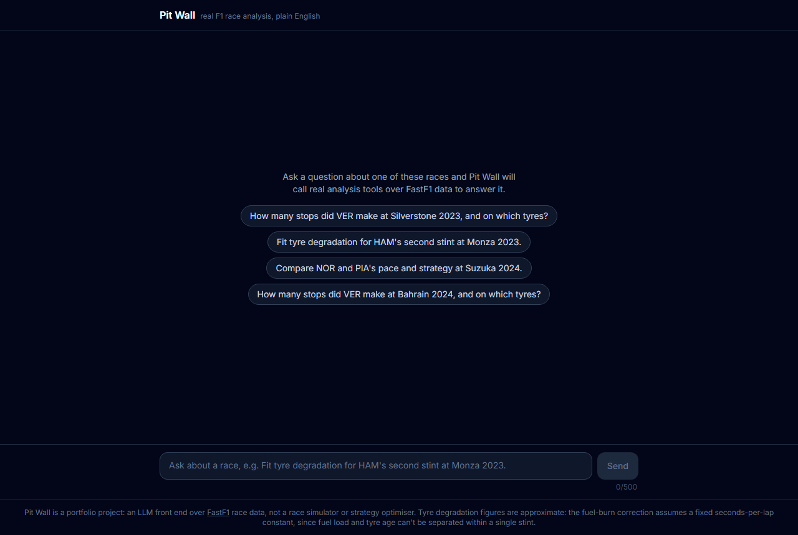
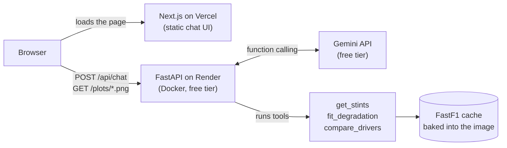

# Pit Wall

Ask Formula 1 race questions in plain English. An LLM answers by calling real analysis tools over [FastF1](https://docs.fastf1.dev/) race data, and plots render inline in the chat.

**Live demo:** _add your Vercel URL here after deploying_



Example questions:

- "How many stops did VER make at Silverstone 2023, and on which tyres?"
- "Fit tyre degradation for HAM's second stint at Monza 2023."
- "Compare NOR and PIA's pace and strategy at Suzuka 2024."

## What it is (and isn't)

Pit Wall is an **LLM front end over three FastF1 analysis tools**. The model does no maths: it decides which tool to call, the tool computes the result, and the model explains it. Every answer shows which tools ran (a small `Ran fit_degradation for HAM, stint 2` line above the reply), so you can see where the numbers came from.

It is **not** a race simulator, a strategy optimiser, or anything involving reinforcement learning. None of those exist here.

| Tool | What it does |
| --- | --- |
| `get_stints` | A driver's tyre stints: compound, lap range, length, starting tyre age. |
| `fit_degradation` | OLS fit of lap time against tyre age for one stint, plus a saved plot. Returns the raw slope, a fuel-corrected slope, standard error, R², and a list of warnings when the fit is unreliable. |
| `compare_drivers` | Two drivers' median clean-lap pace, finishing positions, pit stops and compounds. |

## Architecture



- **Frontend:** Next.js (App Router), TypeScript, Tailwind. It is a client-rendered single page that calls the backend directly using `NEXT_PUBLIC_API_URL`.
- **Backend:** FastAPI. It holds the Gemini key, keeps one chat session per `session_id`, runs the tools, and serves the generated plot PNGs.
- **Why the backend is separate:** FastF1, pandas, statsmodels and matplotlib are too heavy for Vercel serverless functions, so they run in a Docker container.
- **Cold starts:** Render's free tier loses its disk on every spin-down, so `preload.py` downloads all four races into the FastF1 cache during the Docker build and the cache ships inside the image.

### Safeguards

Because it's a public app on free tiers, the backend defends itself:

- Only four races are accepted, enforced server-side in the tools (not just in the prompt). Driver codes must be three letters and exist in that race; stint numbers are range-checked. Tools return `{"error": "..."}` rather than raising.
- 20 chat requests per hour per IP, 500-character messages, 30 messages per session, at most 6 tool-calling rounds per reply.
- A global daily request cap returns a friendly "try again tomorrow" before Google's own quota errors do.
- CORS is restricted to the deployed frontend origin. The API key lives only in an environment variable.
- Plot filenames are built only from validated pieces, never from raw user input.

## Run it locally

Requirements: Python 3.13, Node 20+, and a Gemini API key from [Google AI Studio](https://aistudio.google.com/) (free tier, no billing needed).

**Backend** (PowerShell, from the repo root):

```powershell
python -m venv .venv
.\.venv\Scripts\Activate.ps1
pip install -r backend\requirements.txt

copy backend\.env.example backend\.env
# edit backend\.env: set GEMINI_API_KEY and GEMINI_MODEL

cd backend
uvicorn app.main:app --port 8000
```

On macOS/Linux, activate with `source .venv/bin/activate` and use `cp` instead of `copy`.

**Frontend** (second terminal):

```powershell
cd frontend
copy .env.local.example .env.local
npm install
npm run dev
```

Open <http://localhost:3000>. The first question about a race downloads its data (up to a minute); after that it's cached in `backend/f1_cache`. Run `python preload.py` from `backend/` to fetch all four up front.

> **Port already in use?** If something else owns port 8000, start the backend on another port (e.g. `--port 8001`) and set `NEXT_PUBLIC_API_URL` in `frontend/.env.local` to match. Open the app at `localhost:3000` or `127.0.0.1:3000`; other hostnames won't hydrate under Next's dev server.

**Smoke test** (no Gemini calls, so it costs no quota). It runs every tool on every allowed race plus the validation edge cases:

```powershell
cd backend
python smoke_test_tools.py
```

### Configuration

All set in `backend/.env` locally, or in the platform dashboard when deployed.

| Variable | Required | Purpose |
| --- | --- | --- |
| `GEMINI_API_KEY` | yes | Gemini API key. Never commit it. |
| `GEMINI_MODEL` | yes | Model name. Use a Flash-Lite model to stay inside the free daily quota. |
| `ALLOWED_ORIGINS` | in production | Comma-separated frontend origin(s). Unset allows `localhost:3000` only. |
| `DAILY_REQUEST_CAP` | no | Global cap on chat requests per day (default 150). Tune to your model's real free-tier limit. |
| `MAX_TOOL_CALLS_PER_MESSAGE` | no | Tool-calling rounds per reply (default 6). |
| `SESSION_CACHE_SIZE` | no | Race sessions kept in memory (default 2). |

## Deploy

Everything runs on free tiers with no credit card: Render (backend), Vercel (frontend), the Gemini free tier, and FastF1's public data.

1. **Push to GitHub.**
2. **Backend on [Render](https://render.com):** New → Web Service → connect the repo. Set **Root Directory** `backend`, runtime **Docker**, **Dockerfile Path** `Dockerfile`, instance type **Free**, **Health Check Path** `/health`. Add `GEMINI_API_KEY` and `GEMINI_MODEL`. Deploy, and note the `https://….onrender.com` URL.
3. **Frontend on [Vercel](https://vercel.com):** Add New → Project → import the same repo. Set **Root Directory** `frontend`. Add `NEXT_PUBLIC_API_URL` = the Render URL. Deploy, and note the `https://….vercel.app` URL.
4. **Wire CORS:** back on Render, set `ALLOWED_ORIGINS` to the Vercel URL. Changing an environment variable restarts the service without a rebuild.

## Limitations

Read these before quoting any number from the app.

- **Degradation figures are approximate.** Within a single stint, tyre age and fuel load move together, so a regression cannot separate them. The "fuel-corrected" slope simply adds an **assumed constant of 0.05 s/lap** for fuel burn-off. That constant is not measured, and on some stints it decides the conclusion. For example, a raw slope of -0.03 s/lap becomes +0.02 s/lap after correction purely because of the assumption.
- **The fit knows nothing about traffic, track evolution, safety cars (beyond filtering), or drivers managing pace.** Only green-flag, accurate, non-in/out laps are used. A stint's last lap being much slower (fuel saving, a missed in-lap) can still drag the OLS line, which is why the tool returns warnings for weak fits (R² < 0.3), small samples (< 10 clean laps), slopes indistinguishable from zero, and unusually slow final laps. The model is instructed to repeat them.
- **Pace comparisons are rough.** `compare_drivers` uses median clean-lap time, which mixes compounds and fuel loads.
- **Only four races:** Silverstone 2023, Monza 2023, Suzuka 2024 and Bahrain 2024. They were chosen because they were dry. Suzuka 2024 was red-flagged on lap 1; the tools merge the red-flag pit visit into the stint so it isn't miscounted as a race stop, but its opening stints are short (about 7 to 8 clean laps), so degradation fits there carry a small-sample warning, and some drivers' stints have too few clean laps to fit at all.
- **The LLM can still phrase things badly.** It is told to answer only from tool output and never invent causes, but that is a prompt, not a guarantee. The tool-call lines and plots are the ground truth.
- **Free-tier behaviour.** The backend sleeps after 15 minutes idle and takes about a minute to wake. Gemini's free quota is small, so the demo can say it's busy. The rate limiter, daily cap and chat sessions live in memory, so a restart resets them. There are no accounts or saved history.
- **Testing is light.** There is a smoke test over the tools and validation, and manual end-to-end checks, but no formal test suite. Responses are not streamed.

## Repository layout

```
backend/
  app/
    main.py      FastAPI app: routes, CORS, rate limiting
    tools.py     the three analysis tools, validation, session cache
    agent.py     Gemini chat sessions, system prompt, tool/plot recorder, quota caps
    races.py     the allowed-races list and input validation helpers
  preload.py     caches the allowed races (run during the Docker build)
  smoke_test_tools.py
  Dockerfile
frontend/        Next.js chat UI
pitwall.py       the original single-file terminal prototype, kept for reference
```

## Credits

Race data via [FastF1](https://github.com/theOehrly/Fast-F1). Pit Wall is an independent portfolio project and is not affiliated with or endorsed by Formula 1.
